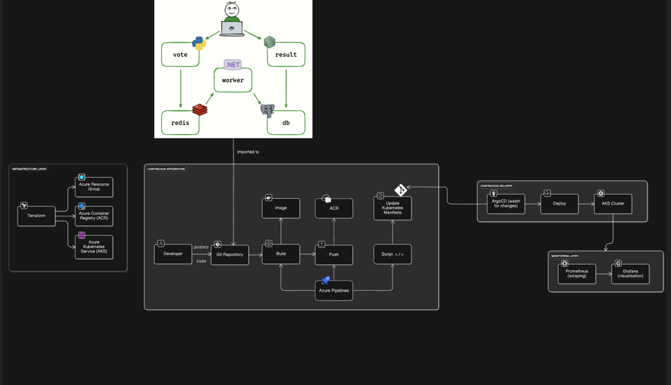

🧩 Project: End-to-End DevOps Implementation on Azure Kubernetes Services(AKS) with GitOps and Monitoring

📘 Overview

This project demonstrates a complete DevOps pipeline that provisions, deploys, and monitors a containerized microservices application—the popular Example Voting App, originally by Docker Inc. 
The end-to-end automation—including infrastructure provisioning, CI/CD, GitOps integration, and monitoring—was independently implemented, configured, and customized on Microsoft Azure. 
While the base app code is public, all DevOps details are self-built, following inspiration from tutorials such as Abhishek Veeramalla’s DevOps series.

🧱 Architecture Overview

1. Infrastructure Layer

Terraform provisions:

Azure Resource Group

Azure Kubernetes Service (AKS) Cluster

Azure Container Registry (ACR)

Backend state securely stored in Azure Storage Account.

2. CI/CD Layer

Azure Pipelines automates:

Building Docker images for vote, result, and worker apps.

Pushing images to ACR.

Updating Kubernetes manifests with new image tags.

ArgoCD provides GitOps:

Continuously syncs manifests from GitHub to AKS.

3. Monitoring Layer

Prometheus and Grafana deployed on AKS for observability.

System-level metrics (node, pod, exporter) are successfully scraped and visualized.

Prometheus <-> vote app “connection refused” issue highlights pending configuration and service discovery adjustments.

🔁 Workflow Summary

1. Developer commits code → GitHub repository.

2. Azure Pipelines triggers build, pushes images to ACR.

3. Updated manifests committed → ArgoCD detects and deploys to AKS.

4. Prometheus + Grafana monitor workloads in (partial) real time.

🧠 Tools & Technologies
           
------------+---------------------

1. IaC -  Terraform          
2. Cloud -  Microsoft Azure    
3. CI/CD  -  Azure Pipelines    
4. GitOps  -  ArgoCD             
5. Containers - Docker, Kubernetes 
6. Monitoring - Prometheus, Grafana
7. SCM -  GitHub             

📚 References

Base application: https://github.com/dockersamples/example-voting-app

Tutorial inspiration: Abhishek Veeramalla – DevOps Projects Series (YouTube)

Note: All infrastructure, automation, pipelines, and monitoring configuration in this repo are custom and original.

🧩 Future Enhancements

1. Fix Prometheus “connection refused” for application metrics.

2. Implement Prometheus Alertmanager for automated alerts.

3. Extend Grafana dashboards for app-level performance metrics.

